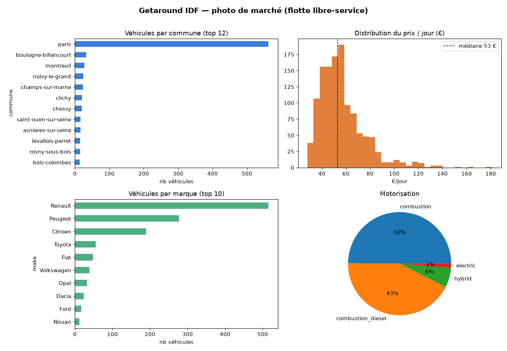

# Getaround IDF — rapport d'étude de marché

> _Régénéré le 2026-07-12 22:09 · état collecte : 🟢 à jour (dernier passage il y a 0.1 h)_

- **Passage analysé** : 2026-07-12 22:01:41
- **Passages collectés** : 799
- **Flotte** : 1232 véhicules sur 104 communes
- **Prix/jour** : médiane 53 € (min 28 / max 181)

## Répartition géographique (top 10 communes)

| Commune | Véhicules |
|---|---|
| paris | 562 |
| boulogne-billancourt | 34 |
| montreuil | 27 |
| noisy-le-grand | 24 |
| champs-sur-marne | 23 |
| clichy | 21 |
| chessy | 18 |
| rosny-sous-bois | 16 |
| levallois-perret | 15 |
| saint-ouen-sur-seine | 15 |

## Parc par marque (top 8)

| Marque | Véhicules |
|---|---|
| Renault | 521 |
| Peugeot | 271 |
| Citroen | 184 |
| Toyota | 55 |
| Fiat | 45 |
| Opel | 34 |
| Volkswagen | 32 |
| Dacia | 24 |

## Motorisation

| Type | Véhicules |
|---|---|
| combustion | 604 |
| combustion_diesel | 538 |
| hybrid | 74 |
| electric | 15 |

## Demande mesurée
- Occupation moyenne : 14.2%
- Véhicules avec ≥1 location détectée : 138 / 1433
- Véhicules à prix variable (pricing dynamique) : 62