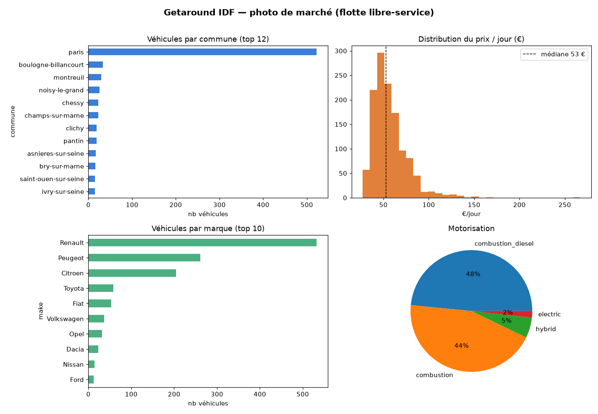

# Getaround IDF — rapport d'étude de marché

> _Régénéré le 2026-08-26 16:55 · état collecte : 🟢 à jour (dernier passage il y a 0.5 h)_

- **Passage analysé** : 2026-08-26 16:22:53
- **Passages collectés** : 4915
- **Flotte** : 1249 véhicules sur 103 communes
- **Prix/jour** : médiane 53 € (min 28 / max 181)

## Répartition géographique (top 10 communes)

| Commune | Véhicules |
|---|---|
| paris | 525 |
| boulogne-billancourt | 33 |
| montreuil | 30 |
| noisy-le-grand | 24 |
| champs-sur-marne | 22 |
| chessy | 21 |
| clichy | 18 |
| pantin | 17 |
| saint-ouen-sur-seine | 16 |
| malakoff | 16 |

## Parc par marque (top 8)

| Marque | Véhicules |
|---|---|
| Renault | 524 |
| Peugeot | 270 |
| Citroen | 202 |
| Toyota | 54 |
| Fiat | 48 |
| Volkswagen | 36 |
| Opel | 29 |
| Dacia | 26 |

## Motorisation

| Type | Véhicules |
|---|---|
| combustion_diesel | 586 |
| combustion | 582 |
| hybrid | 63 |
| electric | 18 |

## Demande mesurée
- Occupation moyenne : 36.8%
- Véhicules avec ≥1 location détectée : 750 / 1957
- Véhicules à prix variable (pricing dynamique) : 297