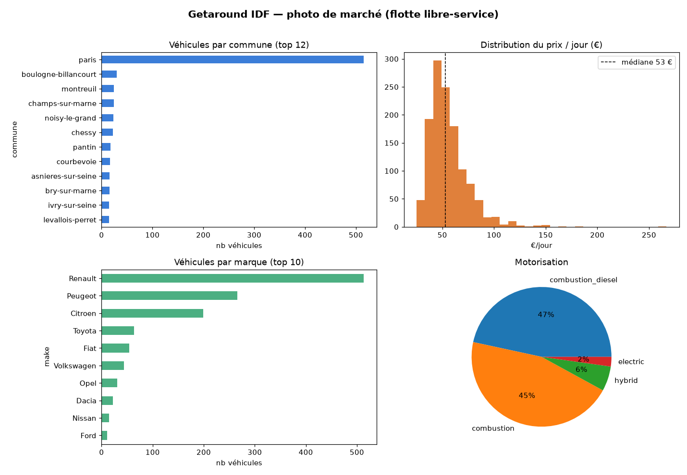

# Getaround IDF — rapport d'étude de marché

> _Régénéré le 2026-10-05 15:02 · état collecte : 🟢 à jour (dernier passage il y a 0.9 h)_

- **Passage analysé** : 2026-10-05 14:07:48
- **Passages collectés** : 7527
- **Flotte** : 1256 véhicules sur 109 communes
- **Prix/jour** : médiane 53 € (min 25 / max 267)

## Répartition géographique (top 10 communes)

| Commune | Véhicules |
|---|---|
| paris | 511 |
| boulogne-billancourt | 31 |
| champs-sur-marne | 24 |
| montreuil | 23 |
| noisy-le-grand | 23 |
| chessy | 22 |
| pantin | 18 |
| courbevoie | 17 |
| asnieres-sur-seine | 17 |
| ivry-sur-seine | 16 |

## Parc par marque (top 8)

| Marque | Véhicules |
|---|---|
| Renault | 519 |
| Peugeot | 264 |
| Citroen | 200 |
| Toyota | 63 |
| Fiat | 51 |
| Volkswagen | 45 |
| Opel | 29 |
| Dacia | 20 |

## Motorisation

| Type | Véhicules |
|---|---|
| combustion_diesel | 587 |
| combustion | 573 |
| hybrid | 70 |
| electric | 25 |

## Demande mesurée
- Occupation moyenne : 46.0%
- Véhicules avec ≥1 location détectée : 1243 / 2304
- Véhicules à prix variable (pricing dynamique) : 1110